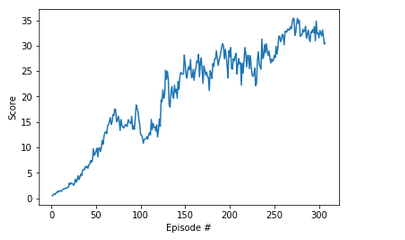

# Project Continuous Control Report

## Learning Algorithm

### Algorithm used

Deep Deterministic Policy Grdients algorithm has been used to complete the project.

### Hyperparameters
Following hyperparamaters have been used to train the networks. They were chosen after much experimentaiton.
* BUFFER_SIZE = int(1e6)  # replay buffer size
* BATCH_SIZE = 1024       # minibatch size
* GAMMA = 0.99            # discount factor
* TAU = 1e-3              # for soft update of target parameters
* LR_ACTOR = 5e-4         # learning rate of the actor 
* LR_CRITIC = 1e-3        # learning rate of the critic
* WEIGHT_DECAY = 0.0000   # L2 weight decay

### Network Architectures

#### Actor Network
* Batch normalization on input.
* A hidden layer with 256 units and relu activation.
* Second hidden layer with 128 units and relu activation.

#### Critic Network
* Batch normalization on input.
* A hidden layer with 256 units and relu activation.
* Second hidden layer with 128 <u></u>nits and relu activation.

## Plot of rewards

The task was completed in 307 episodes.

## Future ideas
Project will be solved using other algorithms such as PPO, Dueling DQN and prioritized experience replay.